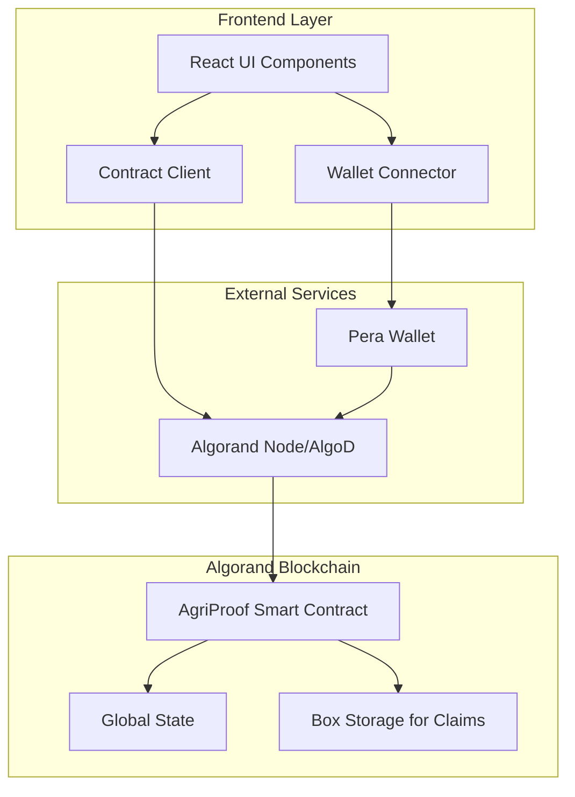
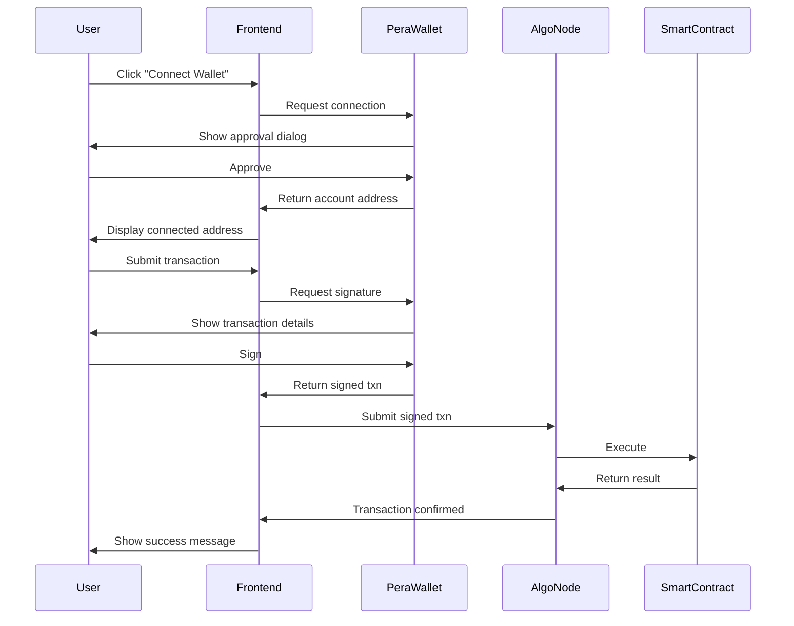
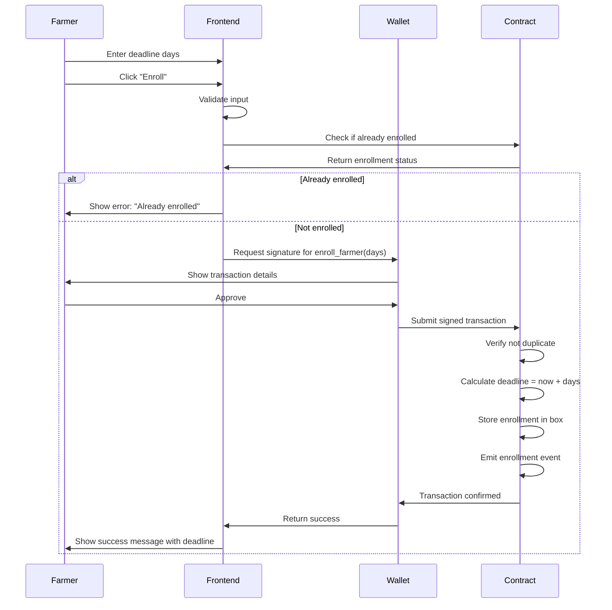
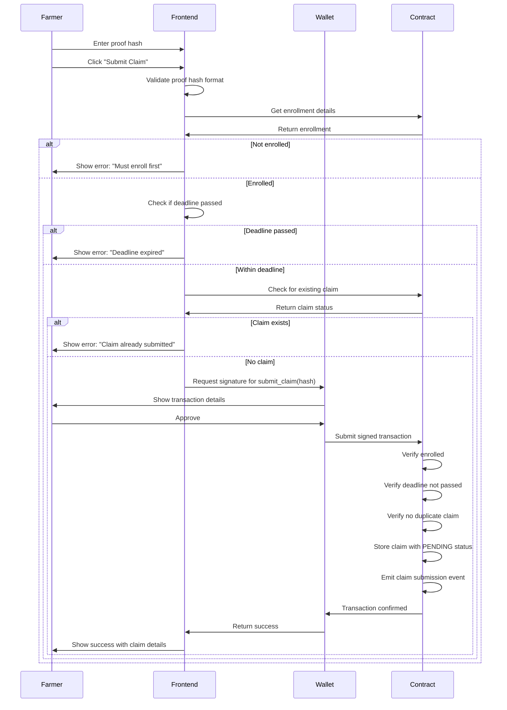
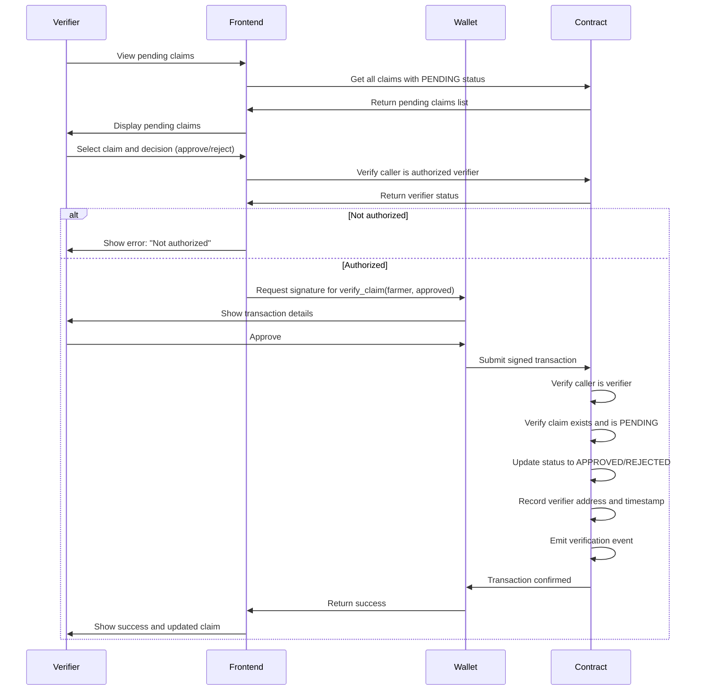
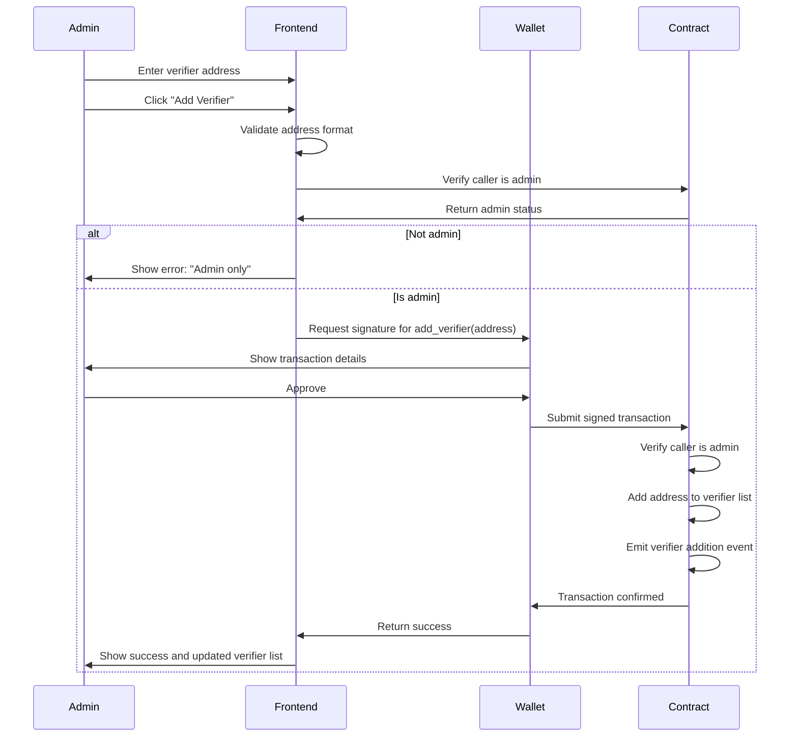

# Technical Design Document: AgriProof Claim Registry

## Overview

AgriProof is a decentralized agricultural claim registry system built on the Algorand blockchain. The system provides a transparent, tamper-proof platform for managing crop damage claims through smart contracts, enabling farmers to submit claims, verifiers to approve them, and administrators to manage the system.

The architecture consists of three main layers:

1. **Smart Contract Layer**: Algorand smart contract written in Python using the Beaker framework, managing all on-chain state and business logic
2. **Frontend Layer**: React + TypeScript + Vite web application providing the user interface
3. **Wallet Integration Layer**: Pera Wallet integration for transaction signing and account management

The system implements role-based access control with three distinct roles:
- **Admin**: System governance authority (set at deployment)
- **Verifier**: Insurance authorities who approve/reject claims
- **Farmer**: Claimants who enroll and submit crop damage claims

All claim data, including proof hashes, timestamps, and status transitions, are stored immutably on-chain to ensure transparency and auditability.

## Architecture

### System Architecture Diagram



### Smart Contract Architecture

The smart contract is structured using Beaker's application framework with the following key components:

**State Management:**
- **Global State**: Stores admin address and system-wide configuration
- **Box Storage**: Stores individual claim records and enrollment data (scalable storage)
- **Local State**: Not used (all data in global/box storage for transparency)

**Access Control Pattern:**
- Admin address stored immutably in global state at deployment
- Verifier addresses stored in box storage with efficient lookup
- Role checks performed at method entry using decorators/assertions

**Storage Strategy:**
- Use box storage for claims and enrollments to avoid global state limits
- Each farmer has a unique box key derived from their address
- Verifier list stored in a dedicated box for efficient membership checks
- Box storage allows the system to scale to thousands of claims

### Frontend Architecture

**Component Structure:**
```
src/
├── components/
│   ├── WalletConnect.tsx       # Wallet connection UI
│   ├── EnrollmentForm.tsx      # Farmer enrollment
│   ├── ClaimSubmission.tsx     # Claim submission form
│   ├── ClaimVerification.tsx   # Verifier approval interface
│   ├── VerifierManagement.tsx  # Admin verifier controls
│   ├── ClaimHistory.tsx        # Claim list and filtering
│   └── ClaimStatus.tsx         # Individual claim details
├── services/
│   ├── walletService.ts        # Pera Wallet integration
│   ├── contractService.ts      # Smart contract interaction
│   └── algoClient.ts           # Algorand client setup
├── types/
│   ├── claim.ts                # Claim data types
│   └── contract.ts             # Contract method types
└── utils/
    ├── errorHandler.ts         # Error message parsing
    └── formatters.ts           # Data formatting utilities
```

**State Management:**
- React Context for wallet connection state
- React Query for contract data fetching and caching
- Local component state for form inputs

**Wallet Integration Flow:**


## Components and Interfaces

### Smart Contract Methods

**Initialization:**
```python
@app.create
def create() -> Expr:
    """
    Initialize the smart contract.
    Sets the deployer as admin.
    """
    return Seq([
        App.globalPut(Bytes("admin"), Txn.sender()),
        Approve()
    ])
```

**Farmer Enrollment:**
```python
@app.external
def enroll_farmer(deadline_days: abi.Uint64) -> Expr:
    """
    Enroll a farmer in the system.
    
    Args:
        deadline_days: Number of days from now until claim deadline
        
    Preconditions:
        - Farmer must not already be enrolled
        
    Postconditions:
        - Farmer enrollment stored in box storage
        - Enrollment event emitted
    """
```

**Claim Submission:**
```python
@app.external
def submit_claim(proof_hash: abi.String) -> Expr:
    """
    Submit a crop damage claim.
    
    Args:
        proof_hash: Cryptographic hash of damage evidence
        
    Preconditions:
        - Caller must be enrolled
        - Current time must be before deadline
        - Farmer must not have existing claim
        
    Postconditions:
        - Claim stored with pending status
        - Claim submission event emitted
    """
```

**Claim Verification:**
```python
@app.external
def verify_claim(farmer_address: abi.Address, approved: abi.Bool) -> Expr:
    """
    Approve or reject a claim.
    
    Args:
        farmer_address: Address of farmer whose claim to verify
        approved: True to approve, False to reject
        
    Preconditions:
        - Caller must be authorized verifier
        - Claim must exist and be in pending status
        
    Postconditions:
        - Claim status updated to approved/rejected
        - Verifier address and timestamp recorded
        - Verification event emitted
    """
```

**Verifier Management:**
```python
@app.external
def add_verifier(verifier_address: abi.Address) -> Expr:
    """
    Add a new verifier to the authorized list.
    
    Preconditions:
        - Caller must be admin
        
    Postconditions:
        - Verifier address added to authorized list
        - Verifier addition event emitted
    """

@app.external
def remove_verifier(verifier_address: abi.Address) -> Expr:
    """
    Remove a verifier from the authorized list.
    
    Preconditions:
        - Caller must be admin
        
    Postconditions:
        - Verifier address removed from authorized list
        - Verifier removal event emitted
    """
```

**Query Methods:**
```python
@app.external(read_only=True)
def get_claim(farmer_address: abi.Address) -> ClaimDetails:
    """
    Retrieve claim details for a farmer.
    
    Returns:
        ClaimDetails: Proof hash, status, timestamps, verifier
    """

@app.external(read_only=True)
def is_verifier(address: abi.Address) -> abi.Bool:
    """
    Check if an address is an authorized verifier.
    """

@app.external(read_only=True)
def get_enrollment(farmer_address: abi.Address) -> EnrollmentDetails:
    """
    Retrieve enrollment details for a farmer.
    
    Returns:
        EnrollmentDetails: Enrollment timestamp, deadline
    """
```

### Frontend Service Interfaces

**Wallet Service:**
```typescript
interface WalletService {
  connect(): Promise<string>;
  disconnect(): Promise<void>;
  getAddress(): string | null;
  signTransaction(txn: Transaction): Promise<SignedTransaction>;
  isConnected(): boolean;
}
```

**Contract Service:**
```typescript
interface ContractService {
  enrollFarmer(deadlineDays: number): Promise<TransactionResult>;
  submitClaim(proofHash: string): Promise<TransactionResult>;
  verifyClaim(farmerAddress: string, approved: boolean): Promise<TransactionResult>;
  addVerifier(verifierAddress: string): Promise<TransactionResult>;
  removeVerifier(verifierAddress: string): Promise<TransactionResult>;
  getClaim(farmerAddress: string): Promise<ClaimDetails | null>;
  getEnrollment(farmerAddress: string): Promise<EnrollmentDetails | null>;
  isVerifier(address: string): Promise<boolean>;
  getAllClaims(offset: number, limit: number): Promise<ClaimDetails[]>;
}
```

## Data Models

### Claim Data Structure

```python
class ClaimStatus(abi.Enum):
    PENDING = 0
    APPROVED = 1
    REJECTED = 2

class Claim(abi.NamedTuple):
    proof_hash: abi.Field[abi.String]           # Immutable evidence hash
    status: abi.Field[ClaimStatus]              # Current claim status
    submission_timestamp: abi.Field[abi.Uint64] # Block timestamp when submitted
    verifier_address: abi.Field[abi.Address]    # Address of verifier (if verified)
    verification_timestamp: abi.Field[abi.Uint64] # Block timestamp when verified
```

**Storage Key:** `claim_{farmer_address}`

**Invariants:**
- `proof_hash` is immutable after initial storage
- `status` transitions: PENDING → APPROVED or PENDING → REJECTED (no reversals)
- `submission_timestamp` is set once and never changes
- `verifier_address` and `verification_timestamp` are zero until verification occurs

### Enrollment Data Structure

```python
class Enrollment(abi.NamedTuple):
    enrollment_timestamp: abi.Field[abi.Uint64] # Block timestamp when enrolled
    claim_deadline: abi.Field[abi.Uint64]       # Block timestamp deadline for claims
```

**Storage Key:** `enrollment_{farmer_address}`

**Invariants:**
- `claim_deadline` > `enrollment_timestamp`
- Once created, enrollment cannot be modified or deleted

### Verifier List Structure

```python
# Stored as a dynamic array in a single box
class VerifierList(abi.NamedTuple):
    verifiers: abi.Field[abi.DynamicArray[abi.Address]]
```

**Storage Key:** `verifiers`

**Operations:**
- Add: Append to array if not already present
- Remove: Find and remove from array
- Check: Linear search for membership (acceptable for small verifier lists)

### Frontend TypeScript Types

```typescript
enum ClaimStatus {
  PENDING = 'pending',
  APPROVED = 'approved',
  REJECTED = 'rejected'
}

interface Claim {
  farmerAddress: string;
  proofHash: string;
  status: ClaimStatus;
  submissionTimestamp: number;
  verifierAddress: string | null;
  verificationTimestamp: number | null;
}

interface Enrollment {
  farmerAddress: string;
  enrollmentTimestamp: number;
  claimDeadline: number;
}

interface TransactionResult {
  success: boolean;
  transactionId?: string;
  error?: string;
}

interface ClaimDetails extends Claim {
  enrollment: Enrollment;
  isExpired: boolean;
  daysUntilDeadline: number;
}
```

## Transaction Flows

### Enrollment Flow



### Claim Submission Flow



### Claim Verification Flow



### Verifier Management Flow




## Correctness Properties

*A property is a characteristic or behavior that should hold true across all valid executions of a system—essentially, a formal statement about what the system should do. Properties serve as the bridge between human-readable specifications and machine-verifiable correctness guarantees.*

### Property Reflection

After analyzing all acceptance criteria, I identified the following redundancies:

**Redundant Properties Eliminated:**
- 3.3 is redundant with 3.2 (both test deadline enforcement)
- 4.2, 4.3 are redundant with 3.6 (all test duplicate claim prevention)
- 8.1, 8.2, 8.3 are redundant with 3.4 (all test proof hash immutability)
- 10.1 is redundant with 6.3 (admin access control)
- 10.2 is redundant with 5.3 (verifier access control)
- 10.3 is redundant with 3.1 (farmer enrollment check)
- 13.1, 13.2 are redundant with 3.2 (deadline enforcement)
- 14.4 is redundant with 7.1 and 7.2 (query correctness)

**Properties Combined:**
- 5.1 and 5.2 can be combined into a single property about status transitions
- 7.1 and 7.2 can be combined into a single property about query correctness

This reflection ensures each property provides unique validation value without overlap.

### Property 1: Admin Immutability

*For any* sequence of operations performed on the smart contract after deployment, the admin address SHALL remain equal to the deployer address.

**Validates: Requirements 1.4**

### Property 2: Enrollment Records Farmer with Deadline

*For any* farmer address and deadline_days value, when enrollment succeeds, querying the enrollment SHALL return a record with the farmer address and a deadline equal to enrollment_timestamp + (deadline_days * seconds_per_day).

**Validates: Requirements 2.1, 2.2**

### Property 3: Duplicate Enrollment Prevention

*For any* farmer address, if the farmer is already enrolled, then attempting to enroll again SHALL be rejected.

**Validates: Requirements 2.3**

### Property 4: Enrollment Timestamp Storage

*For any* enrolled farmer, querying their enrollment SHALL return a non-zero enrollment timestamp.

**Validates: Requirements 2.5**

### Property 5: Claim Submission Requires Enrollment

*For any* address that is not enrolled, attempting to submit a claim SHALL be rejected.

**Validates: Requirements 3.1, 10.3**

### Property 6: Deadline Enforcement

*For any* enrolled farmer, if the current block timestamp exceeds their claim deadline, then attempting to submit a claim SHALL be rejected.

**Validates: Requirements 3.2, 3.3, 13.1, 13.2**

### Property 7: Proof Hash Immutability

*For any* claim, once the proof hash is stored, any sequence of subsequent operations SHALL preserve the original proof hash value unchanged.

**Validates: Requirements 3.4, 8.1, 8.2, 8.3**

### Property 8: Initial Claim Status is Pending

*For any* valid claim submission, querying the claim immediately after submission SHALL return a status of PENDING.

**Validates: Requirements 3.5**

### Property 9: Duplicate Claim Prevention

*For any* farmer address, if the farmer has already submitted a claim, then attempting to submit another claim SHALL be rejected.

**Validates: Requirements 3.6, 4.2, 4.3**

### Property 10: Claim Status Transitions

*For any* pending claim and authorized verifier, when the verifier approves or rejects the claim, the claim status SHALL transition to APPROVED or REJECTED respectively, and SHALL NOT transition to any other status.

**Validates: Requirements 5.1, 5.2**

### Property 11: Verifier Authorization Required

*For any* address that is not an authorized verifier, attempting to verify a claim SHALL be rejected.

**Validates: Requirements 5.3, 10.2**

### Property 12: Verification Metadata Recording

*For any* claim verification, querying the claim after verification SHALL return the verifier's address and a non-zero verification timestamp.

**Validates: Requirements 5.5**

### Property 13: Verifier Addition

*For any* address, when the admin adds it as a verifier, querying whether that address is a verifier SHALL return true.

**Validates: Requirements 6.1**

### Property 14: Verifier Removal Round-Trip

*For any* verifier address, adding it as a verifier and then removing it SHALL result in the address no longer being an authorized verifier.

**Validates: Requirements 6.2**

### Property 15: Admin-Only Verifier Management

*For any* address that is not the admin, attempting to add or remove verifiers SHALL be rejected.

**Validates: Requirements 6.3, 10.1**

### Property 16: Claim Query Correctness

*For any* farmer with a submitted claim, querying the claim SHALL return all stored fields (proof hash, status, submission timestamp, verifier address if verified, verification timestamp if verified) matching the values that were stored.

**Validates: Requirements 7.1, 7.2, 14.4**

### Property 17: Data Serialization Round-Trip

*For any* claim or enrollment data structure, serializing it to box storage and then deserializing it SHALL produce an equivalent data structure with all fields preserved.

**Validates: Requirements 12.5**

## Error Handling

The smart contract implements comprehensive error handling with descriptive error messages for all failure conditions:

**Enrollment Errors:**
- `ERR_ALREADY_ENROLLED`: Farmer is already enrolled in the system
- `ERR_INVALID_DEADLINE`: Deadline days must be greater than zero

**Claim Submission Errors:**
- `ERR_NOT_ENROLLED`: Caller must be enrolled before submitting claims
- `ERR_DEADLINE_PASSED`: Claim deadline has expired
- `ERR_DUPLICATE_CLAIM`: Farmer has already submitted a claim
- `ERR_INVALID_PROOF_HASH`: Proof hash cannot be empty

**Verification Errors:**
- `ERR_NOT_VERIFIER`: Caller is not an authorized verifier
- `ERR_CLAIM_NOT_FOUND`: No claim exists for the specified farmer
- `ERR_CLAIM_NOT_PENDING`: Claim is not in pending status (already verified)

**Verifier Management Errors:**
- `ERR_NOT_ADMIN`: Caller is not the admin
- `ERR_VERIFIER_EXISTS`: Verifier is already in the authorized list
- `ERR_VERIFIER_NOT_FOUND`: Verifier is not in the authorized list

**Query Errors:**
- `ERR_ENROLLMENT_NOT_FOUND`: No enrollment exists for the specified address
- `ERR_CLAIM_NOT_FOUND`: No claim exists for the specified farmer

**Frontend Error Handling:**

The frontend application parses smart contract errors and displays user-friendly messages:

```typescript
function parseContractError(error: Error): string {
  const errorMap: Record<string, string> = {
    'ERR_ALREADY_ENROLLED': 'You are already enrolled in the system.',
    'ERR_NOT_ENROLLED': 'Please enroll before submitting a claim.',
    'ERR_DEADLINE_PASSED': 'Your claim deadline has expired.',
    'ERR_DUPLICATE_CLAIM': 'You have already submitted a claim.',
    'ERR_NOT_VERIFIER': 'You are not authorized to verify claims.',
    'ERR_NOT_ADMIN': 'Only the admin can perform this action.',
    'ERR_CLAIM_NOT_PENDING': 'This claim has already been verified.',
    // ... additional mappings
  };
  
  for (const [code, message] of Object.entries(errorMap)) {
    if (error.message.includes(code)) {
      return message;
    }
  }
  
  // Handle Algorand-specific errors
  if (error.message.includes('insufficient balance')) {
    return 'Insufficient ALGO balance to complete this transaction.';
  }
  
  if (error.message.includes('rejected by user')) {
    return 'Transaction was cancelled.';
  }
  
  return 'An unexpected error occurred. Please try again.';
}
```

**Error Logging:**

All errors are logged to the browser console with full stack traces for debugging:

```typescript
function handleTransactionError(error: Error, context: string): void {
  console.error(`Transaction failed in ${context}:`, {
    message: error.message,
    stack: error.stack,
    timestamp: new Date().toISOString()
  });
  
  // Display user-friendly message
  const userMessage = parseContractError(error);
  showErrorNotification(userMessage);
}
```

**Validation:**

Input validation occurs at multiple layers:

1. **Frontend Validation**: Immediate feedback before transaction submission
   - Address format validation (Algorand address checksum)
   - Proof hash format validation (non-empty string, reasonable length)
   - Numeric input validation (deadline days > 0)

2. **Smart Contract Validation**: Authoritative validation on-chain
   - Role-based access control checks
   - State precondition checks (enrollment, deadline, duplicates)
   - Input parameter validation

This dual-layer approach provides fast user feedback while maintaining security through on-chain validation.

## Testing Strategy

The AgriProof system employs a comprehensive dual testing approach combining unit tests and property-based tests to ensure correctness and reliability.

### Testing Framework Selection

**Smart Contract Testing:**
- **Framework**: PyTest with Algorand Python SDK
- **Property-Based Testing Library**: Hypothesis (Python)
- **Local Development**: AlgoKit LocalNet for isolated testing
- **Test Configuration**: Minimum 100 iterations per property test

**Frontend Testing:**
- **Framework**: Vitest with React Testing Library
- **Property-Based Testing Library**: fast-check (TypeScript)
- **Wallet Mocking**: Mock Pera Wallet for deterministic testing

### Unit Testing Strategy

Unit tests focus on specific examples, edge cases, and integration points:

**Smart Contract Unit Tests:**
- Initialization: Verify admin is set correctly on deployment
- Enrollment: Test successful enrollment with specific deadline values
- Claim submission: Test successful claim with valid proof hash
- Verification: Test approval and rejection with specific claims
- Verifier management: Test adding and removing specific verifiers
- Edge cases: Empty proof hash, zero deadline, non-existent claims
- Error messages: Verify correct error codes for each failure condition

**Frontend Unit Tests:**
- Wallet connection: Test successful connection and disconnection
- Form validation: Test input validation with specific invalid inputs
- Error display: Test error message parsing with specific error codes
- Component rendering: Test UI renders correctly with specific data
- Transaction flow: Test complete flows with mocked contract responses

### Property-Based Testing Strategy

Property tests verify universal properties across all inputs through randomization:

**Smart Contract Property Tests:**

Each property test is tagged with a comment referencing the design document:

```python
@given(
    farmer_address=st.binary(min_size=32, max_size=32),
    deadline_days=st.integers(min_value=1, max_value=365)
)
@settings(max_examples=100)
def test_enrollment_records_farmer_with_deadline(farmer_address, deadline_days):
    """
    Feature: agriproof-claim-registry
    Property 2: For any farmer address and deadline_days value, when enrollment 
    succeeds, querying the enrollment SHALL return a record with the farmer 
    address and a deadline equal to enrollment_timestamp + (deadline_days * seconds_per_day).
    """
    # Test implementation
```

**Property Test Coverage:**

1. **Admin Immutability** (Property 1)
   - Generate random sequences of operations
   - Verify admin address never changes

2. **Enrollment Correctness** (Property 2)
   - Generate random farmer addresses and deadline values
   - Verify enrollment records match expected values

3. **Duplicate Prevention** (Properties 3, 9)
   - Generate random farmers and claims
   - Verify duplicates are always rejected

4. **Enrollment Timestamp** (Property 4)
   - Generate random enrollments
   - Verify timestamps are always stored

5. **Access Control** (Properties 5, 11, 15)
   - Generate random addresses (authorized and unauthorized)
   - Verify only authorized addresses can perform operations

6. **Deadline Enforcement** (Property 6)
   - Generate random timestamps before and after deadlines
   - Verify claims are rejected after deadline

7. **Immutability** (Property 7)
   - Generate random claims and operation sequences
   - Verify proof hashes never change

8. **Status Transitions** (Properties 8, 10)
   - Generate random claims and verifications
   - Verify status transitions follow rules

9. **Metadata Recording** (Property 12)
   - Generate random verifications
   - Verify verifier address and timestamp are recorded

10. **Verifier Management** (Properties 13, 14)
    - Generate random verifier addresses
    - Verify add/remove operations work correctly

11. **Query Correctness** (Property 16)
    - Generate random claims
    - Verify queried data matches stored data

12. **Serialization Round-Trip** (Property 17)
    - Generate random data structures
    - Verify serialization preserves all fields

**Frontend Property Tests:**

```typescript
import fc from 'fast-check';

test('Property: Claim query correctness', () => {
  /**
   * Feature: agriproof-claim-registry
   * Property 16: For any farmer with a submitted claim, querying the claim 
   * SHALL return all stored fields matching the values that were stored.
   */
  fc.assert(
    fc.property(
      fc.string({ minLength: 58, maxLength: 58 }), // Algorand address
      fc.string({ minLength: 1, maxLength: 256 }), // Proof hash
      async (farmerAddress, proofHash) => {
        // Submit claim
        await contractService.submitClaim(proofHash);
        
        // Query claim
        const claim = await contractService.getClaim(farmerAddress);
        
        // Verify all fields match
        expect(claim.proofHash).toBe(proofHash);
        expect(claim.status).toBe(ClaimStatus.PENDING);
        expect(claim.submissionTimestamp).toBeGreaterThan(0);
      }
    ),
    { numRuns: 100 }
  );
});
```

### Test Organization

```
tests/
├── smart_contract/
│   ├── unit/
│   │   ├── test_initialization.py
│   │   ├── test_enrollment.py
│   │   ├── test_claim_submission.py
│   │   ├── test_verification.py
│   │   └── test_verifier_management.py
│   └── properties/
│       ├── test_admin_immutability.py
│       ├── test_enrollment_properties.py
│       ├── test_claim_properties.py
│       ├── test_access_control_properties.py
│       ├── test_deadline_properties.py
│       ├── test_immutability_properties.py
│       ├── test_status_properties.py
│       └── test_serialization_properties.py
└── frontend/
    ├── unit/
    │   ├── WalletConnect.test.tsx
    │   ├── EnrollmentForm.test.tsx
    │   ├── ClaimSubmission.test.tsx
    │   └── ClaimVerification.test.tsx
    └── properties/
        ├── queryCorrectness.test.ts
        └── errorHandling.test.ts
```

### Test Execution

**Local Development:**
```bash
# Start AlgoKit LocalNet
algokit localnet start

# Run smart contract tests
pytest tests/smart_contract/ -v

# Run property tests with coverage
pytest tests/smart_contract/properties/ -v --hypothesis-show-statistics

# Run frontend tests
npm run test

# Run frontend property tests
npm run test:properties
```

**Continuous Integration:**
- All tests run on every pull request
- Property tests run with 100 iterations minimum
- Coverage threshold: 90% for smart contract, 80% for frontend
- Integration tests run against AlgoKit LocalNet

### Testing Balance

The dual testing approach provides comprehensive coverage:

- **Unit tests** catch concrete bugs and verify specific examples
- **Property tests** verify general correctness across all inputs
- Together, they ensure both specific behaviors and universal properties hold

Property-based tests are particularly valuable for:
- Access control (testing all possible unauthorized addresses)
- Deadline enforcement (testing all possible timestamps)
- Duplicate prevention (testing all possible duplicate scenarios)
- Data integrity (testing all possible data values)

Unit tests are particularly valuable for:
- Integration points (wallet connection, contract deployment)
- Specific edge cases (empty inputs, boundary values)
- Error message correctness (specific error codes)
- UI behavior (specific user interactions)

This balanced approach ensures the AgriProof system is correct, secure, and reliable.

